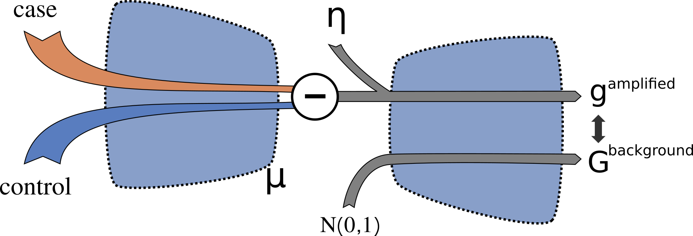

Latent Space Arithmetics to Extracts Disease Modules
================================

## Introduction
Welcome to the github page for extracting gene modules based on signal extraction from multifactorial data. In this context, we introduce the Variational Autoencoder (VAE) method, as outlined in the work by de Weerd et al. (2023). The VAE offers a multi-scale representation capable of encoding cellular processes, encompassing factors from cell types to gene-gene interactions.

In the study by de Weerd et al., we harnessed the power of this VAE to predict gene expression changes in 25 independent disease datasets. Leveraging the learned healthy representations within the VAE, we successfully extracted and decoded disease-specific signals residing within the latent space. As a result, we achieved substantial enrichments of genes directly associated with the diseases under investigation.

## Methods
Here we present how to use our VAE model, as introduced in de Weerd et al., 2023. Moreover, we include the code for the model construction, to serve as a foundation for anyone that wants to train similar models. A VAE of class VAE_class, i.e. the same we used in de Weerd et al., can be constructed in using the Python script VAE_builder.py, building on the Keras package. Models of the VAE_class can be loaded using load_model function in the utils_VAE.py script. 

**Important:** If you want to use the model as was presented in the paper, you can use the the following [link to our Google colab jupyter notebook](https://colab.research.google.com/drive/1GwE2ShhpH8AqcKLZGuz372UJ-7o6O3tP?exids=71471476%2C71471470#scrollTo=xzoM9wLMlUwA)

Figure 1: Outline of the gene module extraction procedure. We devise an approach to extract relevant groups of genes from factorial data, i.e., data containing a disease case and control samples. These two factors are compressed to the latent space and the respective mean difference is calculated, denoted by the disease vector. Next, the disease vector signal is amplified with a factor $\eta$ and decompressed. The decompressed values are then compared to decompressed random, normally distributed data.

Our approach can be summarized in four steps (Fig. 1). First, the vector difference $\nu_{case-controls}$ of the mean compression of patients $Z_{case}$ and controls $Z_{control}$ is obtained from the encoder, as written below.

$$\nu_{case-control} = z_{case}$$

Second, we extract the disease signal $g_{augmented}$ using the decoder $f$, augmented with a factor $\eta$ (default value 3).

$$g_{augmented} = f(\eta*\nu_{case-control})$$

Third, to analyze $g_{augmented} with respect to the gene expression background, a matrix of 1,000 normally distributed random latent space variables, denoted by X, is decompressed to the background gene expression profile $G_{background}$. We remark that $G_{background}$ is a matrix containing 1,000 random gene expression profiles.

$$G_{background} = f(X);\ X \sim N(0,1)$$

Fourth, to extract the most relevant genes in the vector $g$; we rank each gene $i$ for the number of times where the i:th gene, $g_i$, is larger than the corresponding j:th random sample for gene $i$. In other words, we count the number of times the inequality below is satisfied, and can extract the top ranking genes for further study.

$$g_{augmented}^{i} > G_{background}^{i, j}$$

## How to cite
To reference this work, please cite 

Hendrik A de Weerd, Dimitri Guala, Mika Gustafsson, Jane Synnergren, Jesper Tegnér, Zelmina Lubovac-Pilav, Rasmus Magnusson
bioRxiv 2023.10.03.560661; doi: https://doi.org/10.1101/2023.10.03.560661

